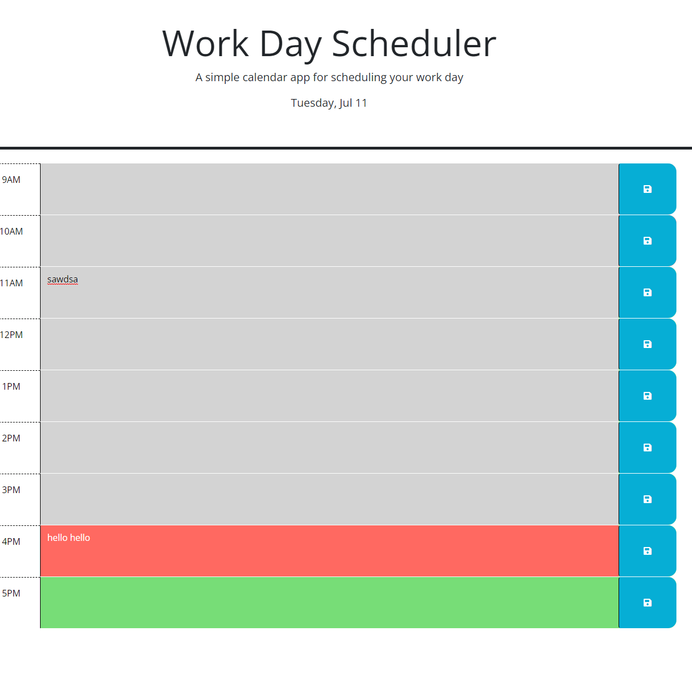

# challenge work day callendar!

## Description
Project created for the Coders Bootcamp Pre-Work

Motivation for completing this project stems from my budding love for Javascript and learning more about just what is capable with such a powerful language. Implementing logic and debugging it has become a serious passion of mine since learning about it in highschool. I am sincerely thankful to be able to think hard about these coding challenges and this camp.

## Installation

N/A

## Usage

Load the page, check the time and day, put in an activity, and press save. Refresh the page and your activities will remain.

## Credits

My classmates helped me a lot on this assignment. I gained heavy inspiration from my friend Lucas who educated me further on the basics of jquery and traversing the DOM.

## Tests

Open the page and save a bunch of stuff to see if it keeps when you reload it

## Images
